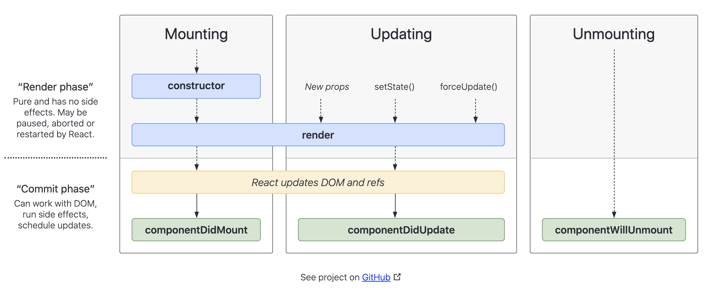

# Component Lifecycle

Components in React have a lifecycle that you can manipulate during its main phases.
React Components lifecycle can be divided into three main phases:

- Mounting
- Updating
- Unmounting

Let's take a look at the [React lifecycle methods diagram](https://projects.wojtekmaj.pl/react-lifecycle-methods-diagram/). **We will focus on the most common lifecycle methods**.



## Mounting

In the mounting phase React will insert the elements into the DOM. And the methods described in the React lifecycle methods diagram will be called.

***constructor***

`constructor()` method is called when a component is initiated. It is used for two main purposes:

- Initializing local state by assigning an object to `this.state`.
- Binding event handler methods to an instance.

> Note: If you don’t initialize state and you don’t bind methods, you don’t need to implement a constructor for your React component.


***render***

The `render()` method is required and is the method that actually outputs the HTML to the DOM.
It returns a single element of the following types:

- React element. 
- Arrays and fragments.
- [Portals](https://reactjs.org/docs/portals.html)(Render children into a DOM node that exists outside the DOM hierarchy of the parent component).
- String and numbers.
- Booleans or null

```js
class App extends React.Component {
  constructor(props) {
   super(props);
   // here we initialize our state object
   this.state = {
     count: 0
   };

   // The bind() is an inbuilt method in React that is used to pass the data as an argument to the function of a class based component.
   // https://www.geeksforgeeks.org/reactjs-bind-method/
   // there are different ways to handle -this- context in React. 
   // https://reactjs.org/docs/faq-functions.html#how-do-i-bind-a-function-to-a-component-instance
   this.handler = this.handler.bind(this);
 };
  
  handler = () => {
    // Changing the state
    this.setState({ count: this.state.count + 1 });
  };
  
  render() {
    return (
      <div>
        <p>You clicked {this.state.count} times</p>
        {/* Passing the count as an argument to the handler() function */}
        <button onClick={this.handler}>
          Increment the counter
        </button>
      </div>
    );
  };
}
```

***componentDidMount***

It is invoked immediately after a component is mounted (inserted into the tree). This is a good place to run statements that require the component is already placed into the DOM, for example, loading data from a remote endpoint.

**Example**
```js

const POKEMON_ENDPOINT = 'https://pokeapi.co/api/v2/pokemon';

class App extends React.Component {
  constructor(props) {
   super(props);
   // here we initialize our state object
   this.state = {
     pokemons: []
   };
 };
  
  async fetchPokemons(){
    // Changing the state
    try {
      const response = await fetch(POKEMON_ENDPOINT);
      const data = await response.json();
      this.setState({ pokemons: data.results });

    } catch (error) {
      this.setState({ pokemons: [] })
    }
  };

  componentDidMount(){ 
    this.fetchPokemons();
  }; 

  render() {
    return (
      <div>
        {
          this.state.pokemons.map(({name}) => <p key={name}>{name}</p>)
        }      
      </div>
    );
  };
}
```
## Updating

A component is updated whenever there is a change in the component's state or props.
React has five built-in methods that get called, in this order, when a component is updated:

***render***

The `render()` method is called when a component gets updated, it has to re-render the HTML to the DOM, with the new changes. 
For the next example, you will need to click the counter button, then you should check the browser's console just to check when it is printing the logs.

```js
class App extends React.Component {
  constructor(props) {
   super(props);
   this.state = {
     count: 0
   };
 };
  
  render() {
    console.log('>>> Rendering');
    return (
      <div>
        <p>You clicked {this.state.count} times</p>
        <button onClick={() => this.setState({ count: this.state.count + 1 })}>
          Increment the counter
        </button>
      </div>
    );
  };
}
```

***componentDidUpdate***

The `componentDidUpdate()` method is called after the component is updated in the DOM. This method is not called for the initial render.

This is a good place to do network requests because you compare the current props to previous props.

```js
class App extends React.Component {
  constructor(props) {
   super(props);
   this.state = {
     count: parseInt(localStorage.getItem('count')) || 0
   };
 };

 componentDidUpdate(){
   console.log('>>> Updated');
   localStorage.setItem('count', this.state.count);
 }
  
  render() {
    console.log('>>> Rendering');
    return (
      <div>
        <p>You clicked {this.state.count} times</p>
        <button onClick={() => this.setState({ count: this.state.count + 1 })}>
          Increment the counter
        </button>
      </div>
    );
  };
}
```

## Unmounting

Unmounting means that a Component is removed from the DOM.

***componentWillUnmount***

This is the only built-in method that gets called when a component is unmounted. It is triggered immediately before a component is unmounted and destroyed.

```js
class Title extends React.Component {
  componentWillUnmount() {
   alert('Unmounting the title');
 }
  
  render(){
    return <h1>Hello Push</h1>;
  }
}

class App extends React.Component {
  constructor(props) {
   super(props);
   this.state = {
     showTitle: true
   };
 };
  
  render() {
    const buttonText = this.state.showTitle ? 'Hide title' : 'Show title';
    return (
      <div>
        {this.state.showTitle && <Title/>}
        <button onClick={() => this.setState({ showTitle: !this.state.showTitle })}>
          {buttonText}
        </button>
      </div>
    );
  };
}
```

You should run any cleanup in `componentWillUnmount`. For example invalidating timers, canceling network requests, or cleaning up any subscriptions that were created in `componentDidMount()`.

## Exercise

1. In your forked `react-tutorial` repo, create a new branch named feature/component-lifecycle.
2. Create an `index.html` file within the `8-component-lifecycle` folder.
3. You should create the following App and Child Components using the component lifecycles described in this section.


4. Push your changes and create the Pull Request.

## Sources

- [React lifecycle methods diagram](https://projects.wojtekmaj.pl/react-lifecycle-methods-diagram/)
- [React.Component](https://reactjs.org/docs/react-component.html)
- [React lifecycle](https://www.w3schools.com/react/react_lifecycle.asp#:~:text=Each%20component%20in%20React%20has,Mounting%2C%20Updating%2C%20and%20Unmounting.)
- [Epic React](https://epicreact.dev/learn)
